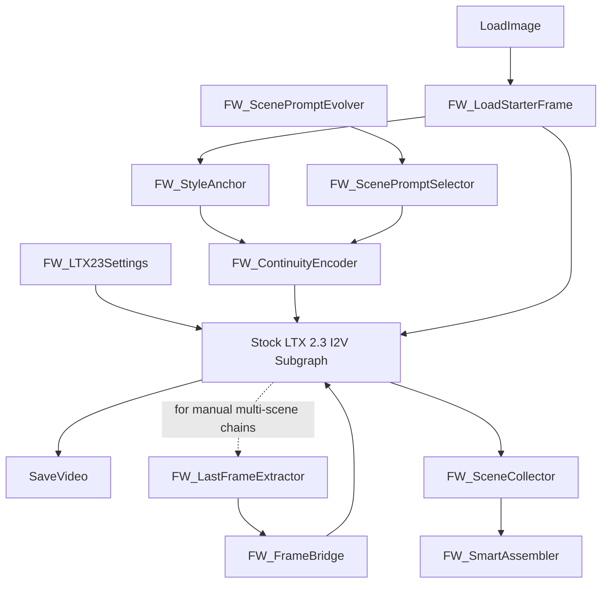

# ComfyUI-FrameWeaver v2 Implementation Plan

FrameWeaver is a ComfyUI custom node pack for building multi-scene LTX 2.3
video workflows. The custom nodes handle scene planning, prompt continuity,
frame-count validation, bridge prompts, scene collection, checkpoint metadata,
and final frame assembly. LTX generation remains delegated to the supported
stock LTX 2.3 nodes from `example-workflow/` so fp8 checkpoint and distilled
LoRA wiring stays compatible with ComfyUI updates.

## Scope

### MVP

1. Use the stock LTX 2.3 image-to-video graph:
   - checkpoint: `ltx-2.3-22b-dev-fp8.safetensors`
   - distilled LoRA: `ltx-2.3-22b-distilled-lora-384.safetensors`
   - prompt-enhancer text encoder: `gemma_3_12B_it_fp4_mixed.safetensors`
   - optional prompt-enhancer LoRA:
     `gemma-3-12b-it-abliterated_lora_rank64_bf16.safetensors`
   - optional latent upscaler:
     `ltx-2.3-spatial-upscaler-x2-1.1.safetensors`
2. Add FrameWeaver utility nodes around the stock graph.
3. Provide loadable workflows that connect FrameWeaver nodes to the stock LTX
   2.3 subgraph.
4. Support manual scene chains first, because ComfyUI workflows are DAGs and do
   not natively loop.

### Advanced

1. Add Qwen image-edit bridge workflows using the local Qwen examples.
2. Add checkpoint resume helpers for long chains.
3. Add optional motion blending or interpolation only after simple assembly is
   stable.

## Architecture

## Node Inventory

| Node | Purpose |
| --- | --- |
| `FW_ScenePromptEvolver` | Builds up to five inherited scene prompts plus negative prompts and bridge prompts. |
| `FW_ScenePromptSelector` | Selects one scene from a `FW_PROMPT_LIST` for manual DAG wiring. |
| `FW_SceneDurationList` | Validates per-scene frame counts to LTX `8n+1` values. |
| `FW_LoadStarterFrame` | Resizes a loaded image tensor to dimensions safe for LTX. |
| `FW_StyleAnchor` | Stores a reference image plus stable style/character description. |
| `FW_ContinuityEncoder` | Produces a continuity-aware text prompt from a scene prompt and style anchor. |
| `FW_LTX23Settings` | Emits model names and validated width, height, frame count, fps, duration. |
| `FW_LatentVideoInit` | Generic latent initializer for tests and non-stock experiments. Stock workflows use `EmptyLTXVLatentVideo`. |
| `FW_LatentGuideInjector` | Generic latent guide helper. Stock workflows use `LTXVImgToVideoInplace`. |
| `FW_SceneSampler` | Sampler settings helper. Stock workflows use `SamplerCustomAdvanced`. |
| `FW_DecodeVideo` | Generic VAE decode helper. Stock workflows use `VAEDecodeTiled`. |
| `FW_LastFrameExtractor` | Extracts the last frame from an `IMAGE` batch. |
| `FW_FrameBridge` | Builds a structured keep/change prompt for a bridge image-edit step. |
| `FW_SceneCollector` | Accumulates scene frames and metadata in `FW_SCENE_COLLECTION`. |
| `FW_SmartAssembler` | Concatenates or crossfades image batches before `CreateVideo`. |
| `FW_QuickPipeline` | Emits ready-to-connect prompts and settings for a simple two-scene setup. |

## Workflow Strategy

`workflows/frameweaver_ltx23_i2v_single_scene.json` is based on
`example-workflow/video_ltx2_3_i2v.json`. It keeps the stock LTX 2.3 subgraph
and connects FrameWeaver nodes to its image, prompt, model, LoRA, dimensions,
length, and fps inputs where the ComfyUI template exposes connectable sockets.

`workflows/frameweaver_ltx23_ia2v_single_scene.json` follows the audio workflow
and connects the same settings and prompt helpers, plus the audio input.

Manual multi-scene workflows should duplicate the stock LTX scene block per
scene. The last frame from scene N can feed `FW_FrameBridge` and then the next
scene's first-frame input after a Qwen edit node or another image-reference
step.

## Technical Constraints

- LTX 2.3 frame counts must be `8n+1`.
- Width and height are rounded to multiples of 32.
- Image tensors are ComfyUI `IMAGE` tensors: `[B, H, W, C]`, float, `0..1`.
- The fp8 checkpoint and distilled LoRA should be loaded by stock nodes, not by
  custom code.
- ComfyUI workflows are DAGs. `FW_QuickPipeline` can prepare values, but it
  cannot internally execute a dynamic loop in the UI graph.

## Verification

1. Import the custom node package with only stdlib dependencies.
2. Unit test prompt evolution, frame validation, continuity prompt generation,
   and scene collection.
3. Validate workflow JSON references existing FrameWeaver node class names and
   preserves the stock LTX 2.3 model/LoRA filenames.
4. Runtime validation inside ComfyUI requires the LTX node pack and model files
   installed in the directories documented by the stock example workflow.
