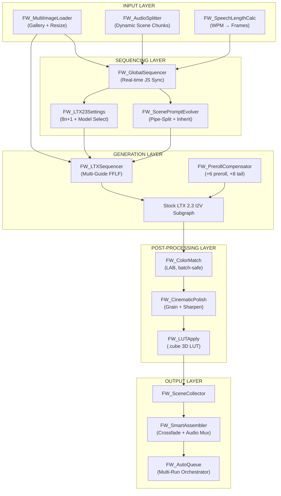

# ComfyUI-FrameWeaver v3 — Implementation Plan

> **Updated:** 2026-04-29 — Incorporates learnings from [VRGameDevGirl](https://github.com/vrgamegirl19/comfyui-vrgamedevgirl) and [WhatDreamsCost](https://github.com/WhatDreamsCost/WhatDreamsCost-ComfyUI).

FrameWeaver is a ComfyUI custom node pack for automated, cinematic multi-scene LTX 2.3 video workflows. It replaces cumbersome manual DAG wiring with a real-time synced Sequencer architecture featuring audio-driven scene durations, automated prompt continuity, multi-image gallery loading, and cinematic post-processing.

LTX generation remains delegated to the stock LTX 2.3 nodes (fp8 checkpoints, distilled LoRAs, Gemma-3 text encoder, optional latent upscaler).

---

## Gap Analysis — What We're Missing vs. The Competition

| Capability | VRGameDevGirl | WhatDreamsCost | FrameWeaver v2 | **v3 Target** |
|---|---|---|---|---|
| Multi-Image Loader with gallery & resize | ❌ | ✅ (50 outputs, gallery JS, resize) | ❌ (basic starter frame) | ✅ **Adopt** |
| Real-time widget sync across nodes | ❌ | ✅ (JS-side sync on Sequencer) | ❌ (planned, not built) | ✅ **Adopt** |
| Seconds ↔ Frames toggle | ❌ | ✅ (`insert_mode` on Sequencer) | ❌ | ✅ **Adopt** |
| Speech Length Calculator | ❌ | ✅ (WPM-based, real-time) | ❌ | ✅ **Adopt** |
| Film Grain (batch-safe) | ✅ (kornia, batch_size limiter) | ❌ | ❌ (planned) | ✅ **Port** |
| Color Match LAB | ✅ (kornia, batch-safe) | ❌ | ❌ (planned) | ✅ **Port** |
| Sharpening (Unsharp/Laplacian/Sobel) | ✅ (CPU+GPU dual-path) | ❌ | ❌ (planned) | ✅ **Port** |
| 3D LUT Loader + LUT Creator | ✅ (.cube parser, palette-to-LUT) | ❌ | ❌ | ✅ **New** |
| Audio Split (dynamic scenes) | ✅ (50 scenes, HUMO mode) | ❌ | ❌ (basic duration calc) | ✅ **Port** |
| Whisper Transcription → Lyrics | ✅ (whisper-large-v3, per-scene) | ❌ | ❌ | ✅ **New** |
| Prompt Splitter (pipe-delimited) | ✅ (dynamic outputs) | ❌ | partial | ✅ **Enhance** |
| Video Combine + Trim/Pad | ✅ (meta-driven, crossfade) | ❌ | partial (SmartAssembler) | ✅ **Enhance** |
| Auto-Queue (multi-run orchestration) | ✅ (`PromptServer.send_sync`) | ❌ | ❌ | ✅ **New** |
| Preroll frame compensation | ✅ (+6 preroll, +8 tail-loss) | ❌ | ❌ | ✅ **New** |
| LTX Sequencer (multi-guide FFLF) | ❌ | ✅ (extends `LTXVAddGuide`, 50 frames) | partial (single guide) | ✅ **Enhance** |
| Frame Math (`8n+1`) | ✅ | ❌ | ✅ | ✅ Keep |

---

## Scope

### MVP (Phases 1–3)

1. **Core LTX 2.3 Integration** — Stock LTX 2.3 I2V graph
2. **Multi-Image Gallery Loader** — 50 outputs, resize modes, compression, drag-and-drop
3. **LTX Sequencer** — Extends `LTXVAddGuide` with seconds/frames toggle, per-image strength, JS sync
4. **Audio Split + Duration Calc** — Dynamic chunking with `8n+1` enforcement, speech-length estimation
5. **Post-Processing Suite** — Film grain, color match, sharpening (all batch-safe)
6. **LUT System** — `.cube` 3D LUT loader + palette-based LUT creator

### Advanced (Phases 4–6)

1. **Auto-Queue Orchestration** — Multi-run chunked generation with preroll/tail-loss compensation
2. **Whisper Transcription** — Per-scene lyric extraction driving prompt evolution
3. **Full Music Video Pipeline** — End-to-end audio → lyrics → scenes → combine → export

---

## Architecture



---

## Node Inventory (25 Nodes)

### Input Nodes (4)

| Node | Status | Source | Purpose |
|---|---|---|---|
| `FW_MultiImageLoader` | **NEW** | WDC `MultiImageLoader` | Gallery UI, 50 outputs, resize (keep/stretch/pad/crop), compression |
| `FW_AudioSplitter` | **NEW** | VRGDG `LoadAudioSplit_General` | Split audio into per-scene chunks, fixed + custom duration modes |
| `FW_SpeechLengthCalc` | **NEW** | WDC `SpeechLengthCalculator` | Real-time WPM calc (slow/avg/fast) from quoted speech |
| `FW_LoadStarterFrame` | EXISTS | — | Single image loader for first-scene init |

### Sequencing Nodes (4)

| Node | Status | Source | Purpose |
|---|---|---|---|
| `FW_GlobalSequencer` | **NEW** | WDC JS sync | Real-time sync of FPS/resolution/scene-index via JS callbacks |
| `FW_ScenePromptEvolver` | ENHANCE | VRGDG `PromptSplitter` | Pipe-delimited split + per-scene context overlay |
| `FW_SceneDurationList` | EXISTS | — | Per-scene duration list with `8n+1` enforcement |
| `FW_LTX23Settings` | EXISTS | — | Model selection + dimension/frame validation |

### Generation Nodes (6)

| Node | Status | Source | Purpose |
|---|---|---|---|
| `FW_LTXSequencer` | **NEW** | WDC `LTXSequencer` | Extends `LTXVAddGuide` — multi-guide FFLF, seconds/frames, per-image strength |
| `FW_PrerollCompensator` | **NEW** | VRGDG preroll | +6 preroll, +8 tail-loss, trim after generation |
| `FW_LatentVideoInit` | EXISTS | — | Initialize blank latent |
| `FW_LatentGuideInjector` | EXISTS | — | Single-guide injection (simple workflows) |
| `FW_SceneSampler` | EXISTS | — | KSampler wrapper |
| `FW_DecodeVideo` | EXISTS | — | VAE decode |

### Continuity Nodes (3)

| Node | Status | Purpose |
|---|---|---|
| `FW_StyleAnchor` | EXISTS | Reference image + style description storage |
| `FW_ContinuityEncoder` | EXISTS | Encode style anchor for conditioning |
| `FW_FrameBridge` | EXISTS | Pass last frame → next scene |

### Post-Processing Nodes (5)

| Node | Status | Source | Purpose |
|---|---|---|---|
| `FW_ColorMatch` | **NEW** | VRGDG `ColorMatchToReference` | LAB color-space matching, kornia, batch_size limiter |
| `FW_CinematicPolish` | **NEW** | VRGDG sharpen nodes | Unified: Unsharp/Laplacian/Sobel modes, CPU+GPU dual-path |
| `FW_FilmGrain` | **NEW** | VRGDG `FastFilmGrain` | Grain intensity + saturation_mix, batch_size limiter |
| `FW_LUTApply` | **NEW** | VRGDG `VRGDG_LUTS` | `.cube` 3D LUT parser with trilinear interp + strength blend |
| `FW_LUTCreate` | **NEW** | VRGDG `VRGDG_MakeLUT` | Hex color palette → `.cube` LUT file generator |

### Output Nodes (3)

| Node | Status | Source | Purpose |
|---|---|---|---|
| `FW_SceneCollector` | EXISTS | — | Accumulate scenes in memory |
| `FW_SmartAssembler` | ENHANCE | VRGDG `CombineVideosV2` | Meta-driven trim/pad, ffmpeg audio mux, crossfade |
| `FW_AutoQueue` | **NEW** | VRGDG auto-queue | `PromptServer.send_sync` for multi-run orchestration |

---

## Technical Design Decisions

### 1. Frame Math (Critical)

```python
# LTX 2.3 requires 8n+1 frames (9, 17, 25, ..., 241)
def nearest_valid_frame_count(frames: int) -> int:
    n = max(1, round((frames - 1) / 8))
    return 8 * n + 1
```

### 2. Preroll + Tail-Loss Compensation (from VRGDG)

- **Preroll:** +6 frames prepended (overlap with previous scene)
- **Tail-loss:** +8 frames appended (LTX drops 7–8 trailing frames)
- After generation, trim to exact target frame count

### 3. Batch-Safe VRAM Pattern (from VRGDG)

```python
def process(self, images, batch_size, ...):
    outputs = []
    for i in range(0, images.shape[0], batch_size):
        batch = images[i:i + batch_size].to(device)
        result = self._process_batch(batch)
        outputs.append(result.cpu())
        del batch; torch.cuda.empty_cache()
    return (torch.cat(outputs, dim=0),)
```

### 4. Real-Time JS Sync (from WDC)

JS extension registers `nodeCreated` callback → on widget change, broadcasts to all sibling nodes → backend receives synced values.

### 5. Auto-Queue Pattern (from VRGDG)

```python
from server import PromptServer
def _auto_queue(self, total_chunks, current_index, enabled):
    if not enabled or current_index != 0:
        return
    for _ in range(total_chunks - 1):
        PromptServer.instance.send_sync("impact-add-queue", {})
```

### 6. Audio Resampling Safety

Always resample to 44.1kHz before splitting for consistent frame calculations.

---

## Dependencies

```
kornia          # LAB color matching
librosa         # Audio loading
imageio         # Video frame I/O
torchaudio      # Audio metadata, resampling
transformers    # Optional: Whisper (Phase 5)
```

---

## Implementation Phases

### Phase 1 — Foundation (Input + Sequencing)

- [ ] **1.1** `FW_MultiImageLoader` — Gallery JS, 50 outputs, resize modes, compression
- [ ] **1.2** `FW_GlobalSequencer` — JS real-time sync of FPS/resolution/scene-index
- [ ] **1.3** `FW_SpeechLengthCalc` — Quoted-text WPM calculator (3 speeds)
- [ ] **1.4** Enhance `FW_ScenePromptEvolver` — Pipe-delimited split + dynamic outputs
- [ ] **Verify:** 5 images → sequencer synced → speech calc outputs valid frames

### Phase 2 — Generation Pipeline

- [ ] **2.1** `FW_LTXSequencer` — Extends `LTXVAddGuide`, seconds/frames, 50 guides
- [ ] **2.2** `FW_PrerollCompensator` — Preroll +6, tail-loss +8, post-trim
- [ ] **2.3** Enhance `FW_LTX23Settings` — Seconds↔frames toggle, audio-connected duration
- [ ] **Verify:** 3-scene FFLF generates correctly, smooth transitions

### Phase 3 — Post-Processing Suite

- [ ] **3.1** `FW_ColorMatch` — LAB matching, kornia, batch_size limiter
- [ ] **3.2** `FW_FilmGrain` — Intensity + saturation, batch-safe
- [ ] **3.3** `FW_CinematicPolish` — Unified sharpen (3 modes), CPU+GPU
- [ ] **3.4** `FW_LUTApply` — `.cube` parser, trilinear interp, strength blend
- [ ] **3.5** `FW_LUTCreate` — Hex palette → `.cube` generator
- [ ] **Verify:** Full chain on 97 frames without OOM (8GB VRAM)

### Phase 4 — Audio Automation

- [ ] **4.1** `FW_AudioSplitter` — Fixed + custom duration, silence pad, stereo
- [ ] **4.2** `FW_AutoQueue` — PromptServer auto-queue, folder indexing, override
- [ ] **4.3** Enhance `FW_SmartAssembler` — Meta trim/pad, ffmpeg audio mux
- [ ] **Verify:** 2-min audio → auto-split → auto-queue → assembled with audio

### Phase 5 — AI-Powered Lyrics

- [ ] **5.1** `FW_WhisperTranscriber` — Per-chunk Whisper, language select, fallbacks
- [ ] **5.2** Wire transcription → prompt evolver — Auto-populate from lyrics
- [ ] **Verify:** Music → per-scene lyrics → prompts → video

### Phase 6 — Polish & Publish

- [ ] **6.1** Example workflows (Quick I2V, Multi-Scene FFLF, Music Video)
- [ ] **6.2** Frontend JS polish — colors, categories, tooltips
- [ ] **6.3** README with install, tutorials, screenshots
- [ ] **6.4** `pyproject.toml` for ComfyUI Manager
- [ ] **6.5** Unit tests (frame math, audio split, color match)
